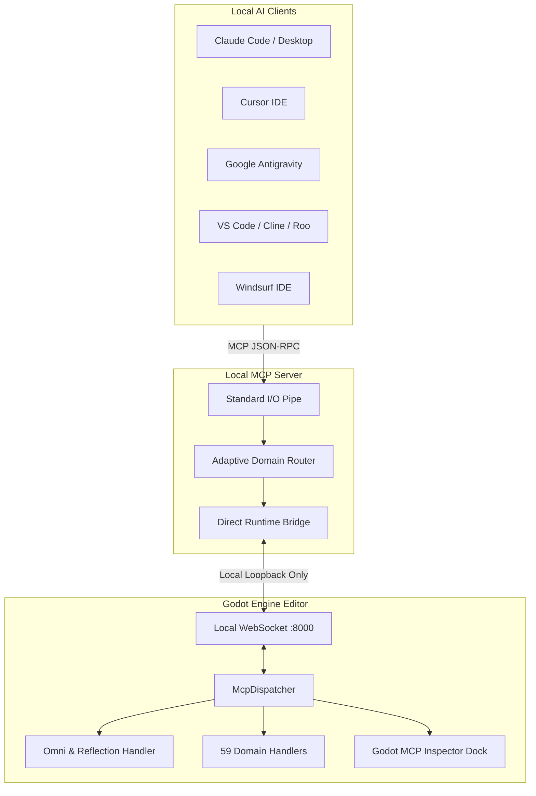

<div align="center">

# Godot MCP

### Free and Open-Source Model Context Protocol Automation Plugin for the Godot Engine

[](https://modelcontextprotocol.io)
[](https://github.com/bebabinlarsson-blip/Godot-MCP/releases)
[](https://godotengine.org)
[](https://www.python.org)
[](LICENSE)
[](LICENSE)
[](https://github.com/bebabinlarsson-blip)

<br>


<br>

**100% Free & Open Source | Fully Local | No External Websites | No npm Packages | No Cloud Logins**

<br>

**Compatible AI Clients**

[Claude Code](https://claude.ai) | [Cursor](https://www.cursor.com) | [Antigravity](https://antigravity.google) | [VS Code / Cline](https://code.visualstudio.com) | [Windsurf](https://codeium.com/windsurf) | [GitHub Copilot](https://github.com/features/copilot) | [OpenAI Codex](https://openai.com)

</div>

---

## Overview

Godot MCP is a completely free, local, open-source automation plugin that connects AI coding assistants to the Godot Editor through the standard Model Context Protocol (MCP).

Unlike other solutions that rely on external websites, cloud subscriptions, device logins, or custom npm CLI wrappers, Godot MCP is designed to be a straightforward in-engine Godot plugin:

* 100% Free and Open Source: Released under the permissive MIT license. No subscriptions, no paid tiers, and no paywalls.
* Completely Local and Private: No external website accounts, no cloud relays, and no OAuth device logins. All communication stays strictly on your local machine.
* Pure Godot Plugin: Drop the addons into your project and enable them in Godot. No npm packages to install, no global node.js tooling, and no external account setup.
* Universal Engine Support: Operates via native GDScript inside Godot, supporting both Standard (GDScript) and .NET (Mono) editions of Godot 4.1 through 4.8+ Dev on Windows, macOS, and Linux.
* 59 Tool Families & 1,820+ Operations: Comprehensive scene building, node transformations, procedural animation, tilemap editing, collision creation, and direct GDScript evaluation.
* Single Native Dock: Seamlessly integrated tab directly beside your Inspector with live activity monitoring, connection diagnostics, and memory indicators.

---

## Tool Families and Capabilities Matrix

Godot MCP provides full engine automation across 59 domain families:

| Family | Key Operations | Description |
| :--- | :--- | :--- |
| **ping** | `ping`, `mcp_ping` | Diagnostic readiness probe echoing engine status, version, process frames, and memory metrics. |
| **node** | `node_create`, `node_set_property`, `node_get_properties`, `node_find`, `node_manage` | Find, spawn, modify, reparent, reorder, duplicate, delete, rotate, scale, and translate nodes in 2D and 3D with undo/redo. |
| **scene** | `scene_open`, `scene_save`, `scene_get_hierarchy`, `scene_manage` | Open, save, create, close, inspect root hierarchies, and instantiate PackedScene prefabs. |
| **script** | `script_create`, `script_patch`, `script_attach`, `script_manage` | Create, anchor-patch, read, detach, inspect symbols, validate syntax/compilation, and delete GDScript files. |
| **filesystem** | `filesystem_manage` | List files and directories with UIDs, read/write text, delete, move, force reimport assets, and trigger editor scans. |
| **resource** | `resource_manage` | Search, load, assign, introspect, create, delete, and move .tres/.res assets, curve profiles, and environment setups. |
| **screenshot** | `editor_screenshot`, `camera_manage` | High-fidelity captures of the 3D viewport, 2D viewport, active cameras, running game frames, and isolated node framing. |
| **editor** | `editor_state`, `editor_manage`, `editor_reload_plugin` | Read editor lifecycle, inspect/set node selections, query performance monitors, clear logs, and execute safe restarts. |
| **console** | `logs_read`, `editor_manage(logs_clear)` | Real-time structured log streaming from plugin events, editor output, debugger errors, and game runtime stdout/stderr. |
| **reflection** | `omni_eval`, `omni_manage(call, get, set, inspect)` | Universal object reflection, dynamic method invocation, property getters/setters, and ClassDB discovery. |
| **tilemap** | `tilemap_manage` | Paint cells, rotate tiles (90, 180, 270 degrees), flip horizontally/vertically, erase, query coordinates, and inspect layers. |
| **tileset** | `tileset_manage` | Inspect atlas source tiles, extract texture slices, and introspect physics and navigation layers. |
| **animation** | `animation_create`, `animation_manage` | Create AnimationPlayers, add property/method tracks, insert keyframes, set autoplay, and apply procedural motion presets. |
| **physics** | `collision_shape_create`, `physics_shape_autofit` | Generate 2D and 3D collision bodies, autofit shapes to visual mesh bounds, and configure collision layers. |
| **mesh** | `mesh_create_primitive` | Procedural generation of BoxMesh, SphereMesh, CylinderMesh, PlaneMesh, CapsuleMesh, and PrismMesh objects with materials. |
| **shader** | `shader_create`, `material_manage` | Author GDShader files, create ShaderMaterials, set uniforms, and assign materials to CanvasItem or MeshInstance3D nodes. |
| **game** | `game_manage`, `project_run` | Launch, stop, restart, and command the running game instance with game helper diagnostics. |
| **input** | `input_map_manage` | Configure InputMap actions, bind keyboard and gamepad events, and query registered input actions. |
| **ui** | `ui_manage`, `ui_semantic_tree`, `ui_click`, `ui_type` | Inspect the semantic control hierarchy of the editor UI, click buttons/tabs, and simulate input keystrokes. |

---

## Quick Start: 3 Simple Steps

You do not need to register on any website or install any npm packages.

### Step 1: Download and Extract the Plugin

1. Download the free release archive `godot-mcp-v5.0.4.zip` from [GitHub Releases](https://github.com/bebabinlarsson-blip/Godot-MCP/releases).
2. Extract the archive into your Godot project root so that the `addons/` folder is placed directly in your project:

```text
your-godot-project/
└── addons/
    ├── godot_ai/
    │   ├── plugin.cfg
    │   ├── plugin.gd
    │   ├── godot_mcp_dock.gd
    │   ├── connection.gd
    │   ├── dispatcher.gd
    │   └── handlers/
    └── godot_omni/
        ├── plugin.cfg
        ├── plugin.gd
        ├── omni_dock.gd
        ├── omni_reflection.gd
        └── omni_ui_tree.gd
```

### Step 2: Enable the Plugin in Godot

1. Open your project in Godot.
2. Open **Project -> Project Settings -> Plugins**.
3. Enable **Godot MCP Core** and **Godot MCP Omni**.
4. The **Godot MCP** tab will appear beside your Inspector on the right-hand side.

### Step 3: Configure Your AI Client

Add Godot MCP to your AI editor of choice. The server runs directly via standard `uvx` without needing manual installation:

#### Cursor
Add to `.cursor/mcp.json`:
```json
{
  "mcpServers": {
    "godot-mcp": {
      "command": "uvx",
      "args": [
        "--from",
        "git+https://github.com/bebabinlarsson-blip/Godot-MCP.git",
        "godot-ai"
      ]
    }
  }
}
```

#### Claude Desktop
Add to `claude_desktop_config.json` (Windows: `%APPDATA%\Claude\claude_desktop_config.json` | macOS: `~/Library/Application Support/Claude/claude_desktop_config.json`):
```json
{
  "mcpServers": {
    "godot-mcp": {
      "command": "uvx",
      "args": [
        "--from",
        "git+https://github.com/bebabinlarsson-blip/Godot-MCP.git",
        "godot-ai"
      ]
    }
  }
}
```

#### Google Antigravity
In Antigravity or Gemini CLI configuration:
```json
{
  "mcpServers": {
    "godot-mcp": {
      "command": "uvx",
      "args": [
        "--from",
        "git+https://github.com/bebabinlarsson-blip/Godot-MCP.git",
        "godot-ai"
      ]
    }
  }
}
```

#### VS Code (Cline / Roo Code)
Add to Cline MCP settings:
```json
{
  "mcpServers": {
    "godot-mcp": {
      "command": "uvx",
      "args": [
        "--from",
        "git+https://github.com/bebabinlarsson-blip/Godot-MCP.git",
        "godot-ai"
      ]
    }
  }
}
```

#### Windsurf
Add to `~/.codeium/windsurf/mcp_config.json`:
```json
{
  "mcpServers": {
    "godot-mcp": {
      "command": "uvx",
      "args": [
        "--from",
        "git+https://github.com/bebabinlarsson-blip/Godot-MCP.git",
        "godot-ai"
      ]
    }
  }
}
```

That is all. Start prompting your AI to build scenes, write scripts, paint tiles, or animate objects in Godot.

---

## The Godot MCP Dock

The single native Godot MCP dock lives beside the Inspector in Godot:

* Live Status: Visual badge displaying connection status ([OK], [IDLE], [WAIT], [ERROR]).
* Tool Call Feed: Live stream of AI commands as they are executed in the engine with millisecond timing.
* Probe Diagnostics: Built-in ping and self-test trigger buttons to verify connection without leaving Godot.
* Memory Metrics: Process frame count, active scene root, and static memory usage metrics.
* Free Port Button: In case port 8000 is held by an orphaned process, a single click clears it and resets the local server.

---

## System Architecture



---

## Verification and Diagnostics

You can verify the local setup directly from the command line:

```bash
# Run the complete test suite
uv run godot-omni self-test

# Inspect tool registry metrics across all 59 domains
uv run godot-omni tools stats
```

---

## Troubleshooting

### Port 8000 In Use
Click **Free Port & Replace Server** in the Godot MCP dock tab, or run in PowerShell:
```powershell
Get-NetTCPConnection -LocalPort 8000 | ForEach-Object { Stop-Process -Id $_.OwningProcess -Force }
```

### Headless Execution
To allow the plugin to run during headless testing or CI:
```powershell
$env:GODOT_AI_ALLOW_HEADLESS="1"
```

---

## Author and License

* Author: [bebabin](https://github.com/bebabinlarsson-blip) (`bebabinlarsson@gmail.com`)
* License: [MIT License](LICENSE) (100% Free and Open Source)