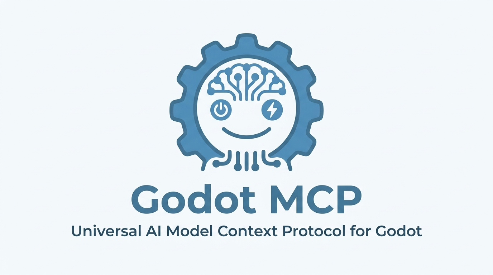
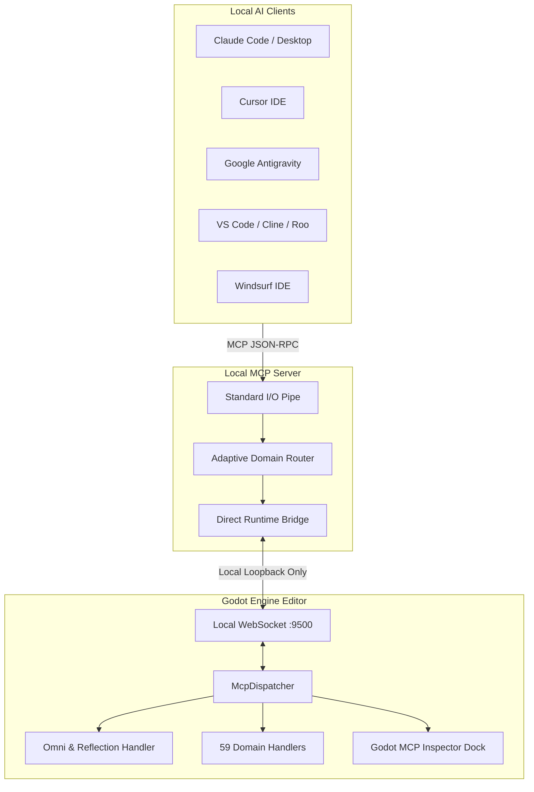

<div align="center">

# Godot MCP

### Free and Open-Source Model Context Protocol Automation Plugin for the Godot Engine

[](https://modelcontextprotocol.io)
[](https://github.com/bebabinlarsson-blip/Godot-MCP/releases)
[](https://godotengine.org)
[](https://www.python.org)
[](LICENSE)
[](LICENSE)
[](https://github.com/bebabinlarsson-blip/Godot-MCP)

<br>



<br>

**100% Free & Open Source | Local by Default | No npm Packages | Optional Public Tunnel**

<br>

**Compatible AI Clients**

[Claude Code](https://claude.ai) | [Cursor](https://www.cursor.com) | [Antigravity](https://antigravity.google) | [VS Code / Cline](https://code.visualstudio.com) | [Windsurf](https://codeium.com/windsurf) | [GitHub Copilot](https://github.com/features/copilot) | [OpenAI Codex](https://openai.com)

</div>

---

## Overview

Godot MCP is a free, open-source editor add-on and Python server that connect AI coding assistants to the Godot Editor through the Model Context Protocol (MCP). This README describes [v5.0.34](https://github.com/bebabinlarsson-blip/Godot-MCP/releases/tag/v5.0.34).

Unlike other solutions that rely on external websites, cloud subscriptions, device logins, or custom npm CLI wrappers, Godot MCP is designed to be a straightforward in-engine Godot plugin:

* 100% Free and Open Source: Released under the permissive MIT license. No subscriptions, no paid tiers, and no paywalls.
* Local by default: communication stays on your machine unless you deliberately start a public tunnel. Public tunnels can expose the MCP server outside your network; see the tunnel security notes below.
* Godot add-ons plus Python server: Copy the add-ons into your project, enable them in Godot, and install Python 3.11–3.14 and `uv` so the editor can start the server. No npm or Node.js installation is required.
* Engine Support: Runs as native GDScript in Standard and .NET editions of Godot 4.7 and newer on Windows, macOS, and Linux.
* 59 Tool Families & 1,820+ Operations: Comprehensive scene building, node transformations, procedural animation, tilemap editing, collision creation, and direct GDScript evaluation.
* Single Native Dock: Seamlessly integrated tab directly beside your Inspector with live activity monitoring, connection diagnostics, and memory indicators.

---

## Tool Families and Capabilities Matrix

Godot MCP provides full engine automation across 59 domain families:

| Family | Key Operations | Description |
| :--- | :--- | :--- |
| **ping** | `ping`, `mcp_ping` | Diagnostic readiness probe echoing engine status, version, process frames, and memory metrics. |
| **node** | `node_create`, `node_set_property`, `node_get_properties`, `node_find`, `node_manage` | Find, spawn, modify, reparent, reorder, duplicate, delete, rotate, scale, and translate nodes in 2D and 3D with undo/redo. |
| **scene** | `scene_open`, `scene_save`, `scene_get_hierarchy`, `scene_manage` | Open, save, create, close, inspect root hierarchies, and instantiate PackedScene prefabs. |
| **script** | `script_create`, `script_patch`, `script_attach`, `script_manage` | Create, anchor-patch, read, detach, inspect symbols, validate syntax/compilation, and delete GDScript files. |
| **filesystem** | `filesystem_manage` | List files, read/write text, delete, move, reimport, trigger scans, download assets from URL, and search free CC0 assets. |
| **resource** | `resource_manage` | Search, load, assign, introspect, create, delete, and move .tres/.res assets, curve profiles, and environment setups. |
| **screenshot** | `editor_screenshot`, `camera_manage` | High-fidelity captures of the 3D viewport, 2D viewport, active cameras, running game frames, and isolated node framing. |
| **editor** | `editor_state`, `editor_manage`, `editor_reload_plugin` | Read editor lifecycle, inspect/set node selections, query performance monitors, clear logs, and execute safe restarts. |
| **console** | `logs_read`, `editor_manage(logs_clear)` | Real-time structured log streaming from plugin events, editor output, debugger errors, and game runtime stdout/stderr. |
| **reflection** | `omni_eval`, `omni_manage(call, get, set, inspect)` | Universal object reflection, dynamic method invocation, property getters/setters, and ClassDB discovery. |
| **tilemap** | `tilemap_manage` | Direct editor tile painting, D4 rotation (0, 90, 180, 270 deg), flips, layer queries, and smart multi-genre layout generation. |
| **tileset** | `tileset_manage` | Inspect atlas source tiles, extract texture slices, and introspect physics and navigation layers. |
| **animation** | `animation_create`, `animation_manage` | Create AnimationPlayers, add property/method tracks, insert keyframes, set autoplay, and apply procedural motion presets. |
| **physics** | `collision_shape_create`, `physics_shape_autofit` | Generate 2D and 3D collision bodies, autofit shapes to visual mesh bounds, and configure collision layers. |
| **mesh** | `mesh_create_primitive` | Procedural generation of BoxMesh, SphereMesh, CylinderMesh, PlaneMesh, CapsuleMesh, and PrismMesh objects with materials. |
| **shader** | `shader_create`, `material_manage` | Author GDShader files, create ShaderMaterials, set uniforms, and assign materials to CanvasItem or MeshInstance3D nodes. |
| **game** | `game_manage`, `project_run` | Launch, stop, restart, and command the running game instance with game helper diagnostics. |
| **input** | `input_map_manage` | Configure InputMap actions, bind keyboard and gamepad events, and query registered input actions. |
| **ui** | `ui_manage`, `ui_semantic_tree`, `ui_click`, `ui_type` | Inspect the semantic control hierarchy of the editor UI, click buttons/tabs, and simulate input keystrokes. |

---

## Quick Start: 3 Simple Steps

You do not need to register on any website or install any npm packages.

### Step 1: Download and Extract the Plugin

1. Download **Source code (zip)** from the [v5.0.34 release](https://github.com/bebabinlarsson-blip/Godot-MCP/releases/tag/v5.0.34). This release currently has GitHub source archives, not a separately attached add-on ZIP.
2. Extract it and copy the `addons/` directory from inside the extracted repository into your Godot project root. Copy both `godot_ai` and `godot_omni`:

```text
your-godot-project/
└── addons/
    ├── godot_ai/
    │   ├── plugin.cfg
    │   ├── plugin.gd
    │   ├── godot_mcp_dock.gd
    │   ├── connection.gd
    │   ├── dispatcher.gd
    │   └── handlers/
    └── godot_omni/
        ├── plugin.cfg
        ├── plugin.gd
        ├── omni_dock.gd
        ├── omni_reflection.gd
        └── omni_ui_tree.gd
```

### Step 2: Enable the Plugin in Godot

1. Open your project in Godot.
2. Open **Project -> Project Settings -> Plugins**.
3. Enable **Godot MCP Core** and **Godot MCP Omni**.
4. The **Godot MCP** tab will appear beside your Inspector on the right-hand side.

### Step 3: Configure Your AI Client

Install [Python 3.11–3.14](https://www.python.org/downloads/) and [uv (`uvx`)](https://docs.astral.sh/uv/getting-started/installation/) on the computer running Godot. The add-on can configure supported local clients from its dock; if you configure a client manually, use an installed `uvx` and the pinned v5.0.34 source below. The first `uvx` launch downloads the Python dependencies:

#### Cursor
Add to `.cursor/mcp.json`:
```json
{
  "mcpServers": {
    "godot-mcp": {
      "command": "uvx",
      "args": [
        "--from",
        "git+https://github.com/bebabinlarsson-blip/Godot-MCP.git@v5.0.34",
        "godot-ai"
      ]
    }
  }
}
```

#### Claude Desktop
Add to `claude_desktop_config.json` (Windows: `%APPDATA%\Claude\claude_desktop_config.json` | macOS: `~/Library/Application Support/Claude/claude_desktop_config.json`):
```json
{
  "mcpServers": {
    "godot-mcp": {
      "command": "uvx",
      "args": [
        "--from",
        "git+https://github.com/bebabinlarsson-blip/Godot-MCP.git@v5.0.34",
        "godot-ai"
      ]
    }
  }
}
```

#### Google Antigravity
In Antigravity or Gemini CLI configuration:
```json
{
  "mcpServers": {
    "godot-mcp": {
      "command": "uvx",
      "args": [
        "--from",
        "git+https://github.com/bebabinlarsson-blip/Godot-MCP.git@v5.0.34",
        "godot-ai"
      ]
    }
  }
}
```

#### VS Code (Cline / Roo Code)
Add to Cline MCP settings:
```json
{
  "mcpServers": {
    "godot-mcp": {
      "command": "uvx",
      "args": [
        "--from",
        "git+https://github.com/bebabinlarsson-blip/Godot-MCP.git@v5.0.34",
        "godot-ai"
      ]
    }
  }
}
```

#### Windsurf
Add to `~/.codeium/windsurf/mcp_config.json`:
```json
{
  "mcpServers": {
    "godot-mcp": {
      "command": "uvx",
      "args": [
        "--from",
        "git+https://github.com/bebabinlarsson-blip/Godot-MCP.git@v5.0.34",
        "godot-ai"
      ]
    }
  }
}
```

Keep Godot open while using the tools. These JSON examples are for clients running on the same computer as the editor. Cloud clients such as ChatGPT Work Mode require a separately configured authenticated HTTPS tunnel; see [Public tunnel access](#public-tunnel-access). A local `uvx` command on a cloud machine cannot reach your Godot editor by itself. The 1,820+ operations are grouped into a smaller MCP tool surface; clients load or search tool schemas according to their own capabilities. An OpenAPI URL alone does not register those tools in a client.

---

## TileMap Authoring and Direct Editor Placement Directive

### The Direct Editor Placement Contract
AI agents connected via Godot MCP follow a strict architectural rule:
* **Always place tiles directly into the open editor scene**: Use `tilemap_manage` (`place_tile`, `set_cell`, `set_cells_rect`, `generate_layout`) to place tiles directly down into the `TileMap` or `TileMapLayer` node.
* **Never write runtime procedural generation scripts in `_ready()`** unless the user explicitly requested runtime procedural level generation.
* **Why this matters**: Direct placement in the editor gives immediate visual feedback, enables manual tweaking in the editor viewport, configures native Godot 2D physics collisions, and saves clean `.tscn` scene files without runtime overhead.

### Dihedral D4 Rotation and Symmetry
Tiles can be rotated clockwise by 90, 180, or 270 degrees and flipped horizontally or vertically with complete mathematical precision using an 8-state transition table that prevents bit-drift:
* 0 degrees: Default orientation (alt = 0)
* 90 degrees: Clockwise rotation (`transpose | flip_h`)
* 180 degrees: Half rotation (`flip_h | flip_v`)
* 270 degrees: Counter-clockwise rotation (`transpose | flip_v`)

### Smart Genre Layout Generation
The `generate_layout` operation can build complete genre-specific level layouts directly in the active editor scene:
* `platformer`: Ground blocks with jump gaps, vertical boundary walls, stepping platforms at reachable jump heights, and floating challenge accents.
* `topdown` / `rpg`: Perimeter stone walls with open doorway transitions, walkable floor tiles, and corner architectural accents.
* `dungeon`: Thick perimeter walls with corridor access, walkable stone paths, and central structural columns.
* `arena`: Symmetrical battle arena boundaries with strategic cover pillars.

---

## Asset Downloader and Free CC0 Search

AI assistants and developers can search for free CC0 assets and download them directly into the Godot project with automatic editor reimport:

### Search Free CC0 Game Assets
Search the built-in catalog of curated CC0 public domain game packs (Kenney tilesets, retro sound effects, UI elements, textures, and 3D models):
```json
{
  "op": "search_assets",
  "params": {
    "query": "platformer",
    "category": "tileset",
    "limit": 10
  }
}
```

### Download Assets into `res://`
Download any asset from a direct URL (or archive package) straight into your project:
```json
{
  "op": "download_asset",
  "params": {
    "url": "https://raw.githubusercontent.com/KenneyNL/Starter-Kits/master/2D%20Platformer/assets/tilemap-characters_packed.png",
    "path": "res://assets/tilesets/platformer_packed.png",
    "reimport": true
  }
}
```
* Single files are written directly and immediately queued for `reimport`.
* ZIP archives (`extract: true`) are safely uncompressed into the destination folder, followed by a full `scan_filesystem` to index all unpacked assets.

---

## The Godot MCP Dock

The single native Godot MCP dock lives beside the Inspector in Godot:

* Live Status: Visual badge displaying connection status ([OK], [IDLE], [WAIT], [ERROR]).
* Tool Call Feed: Live stream of AI commands as they are executed in the engine with millisecond timing.
* Probe Diagnostics: Built-in ping and self-test trigger buttons to verify connection without leaving Godot.
* Memory Metrics: Process frame count, active scene root, and static memory usage metrics.
* Free Port Button: In case port 8000 is held by an orphaned process, a single click clears it and resets the local server.

---

## System Architecture



---

## Verification and Diagnostics

From a checkout of this repository with `uv` installed, you can inspect the installation and tool registry:

```bash
# Run the complete test suite
uv run godot-omni self-test

# Inspect tool registry metrics across all 59 domains
uv run godot-omni tools stats
```

---

## Troubleshooting

### Port 8000 In Use
Check which process owns the HTTP port before restarting it. In the Godot MCP dock, use **Free Port & Replace Server** only for a server you own. The editor WebSocket uses port 9500 by default; port 8000 is the local HTTP endpoint.

### Headless Execution
To allow the plugin to run during headless testing or CI:
```powershell
$env:GODOT_AI_ALLOW_HEADLESS="1"
```

### Public tunnel access

The default `localhost.run` tunnel creates a public hostname for the current
connection. That hostname can change after a reconnect. Cloudflare Quick
Tunnels also use temporary hostnames. Neither option reserves a permanent URL.

For a stable hostname, create a named Cloudflare Tunnel in your Cloudflare
account, route the hostname to `http://127.0.0.1:8000`, and keep both the Godot
editor and `cloudflared` running on an always-on machine. Store the tunnel token
in a file (this option requires cloudflared 2025.4.0 or newer) and set:

```sh
GODOT_AI_CLOUDFLARE_TUNNEL_TOKEN_FILE=/path/to/cloudflare-token
GODOT_AI_TUNNEL_PUBLIC_URL=https://mcp.example.com
godot-ai tunnel --provider cloudflare-named
```

On Windows, set the same environment variables in PowerShell before running
`godot-ai tunnel`. The stable hostname is configured in Cloudflare DNS; it
cannot be reserved by this plugin. A hostname stays reachable only while the
machine, editor server, and tunnel process are online.

Treat any public tunnel as an internet-facing endpoint. Configure the same
`GODOT_AI_AUTH_TOKEN` in the MCP server and the AI client's Bearer
authorization. Start Godot with the token set before launching the editor.
Every automated public tunnel provider refuses to start unless `/api/v1/status`
rejects anonymous requests and accepts that token. The `ngrok` provider reads
the endpoint from ngrok's local Agent API at `127.0.0.1:4040`; keep that API
bound to loopback. Share the URL only with intended clients.

The MCP gateway advertises its available tools at `/api/v1/tools` and exposes
the OpenAPI document at `/openapi.json`. The editor and tunnel process must
both remain online for those tools to be reachable.

Open **Remote Setup** in the Godot MCP dock to see the local connection state,
hostname configuration, and setup steps. Run `godot-ai tunnel doctor` to check
the Cloudflare binary, named-tunnel token file, local bearer enforcement, and
the authenticated public status and tool catalog. The doctor never prints
the bearer token or Cloudflare token. Use `--local-only` when your hostname has
not been routed yet.

### Inspect before editing

`project_manage(op="get_map")` provides a small, read-only index of the open
project's scenes, scripts, assets, resources, autoloads, and input actions.
`tileset_manage(op="tileset_diagnose", params={"tileset_path": "res://..."})`
reports atlas and texture problems; pass `check_collision=true` to flag tiles
without polygons on a selected physics layer. Rotated alternatives alone are
not considered broken.

`batch_execute(commands=[...], preview=true)` previews up to 30 `create_node`
or `delete_node` edits in an open scene, shows scene nodes before and after,
and undoes its changes. Call the same batch with `preview=false` to keep it.
Preview does not capture screenshots or support file-writing commands.

Published v5 releases attach an add-ons-only ZIP after the release workflow
verifies its structure and loads it into a fresh Godot project. Extract the ZIP
at the project root, then enable the plugin in Godot's Project Settings.

---

## Author and License

* Project credits: **[Ghosty (@ghostySRC)](https://github.com/ghostySRC)** and **[Bebabin (@bebabinlarsson-blip)](https://github.com/bebabinlarsson-blip)**
* License: [MIT License](LICENSE) (100% Free and Open Source)

For Godot Asset Library listings, use the direct icon files:
[Godot MCP Core](https://raw.githubusercontent.com/bebabinlarsson-blip/Godot-MCP/main/addons/godot_ai/icon.png) ·
[Godot MCP Omni](https://raw.githubusercontent.com/bebabinlarsson-blip/Godot-MCP/main/addons/godot_omni/icon.png).
